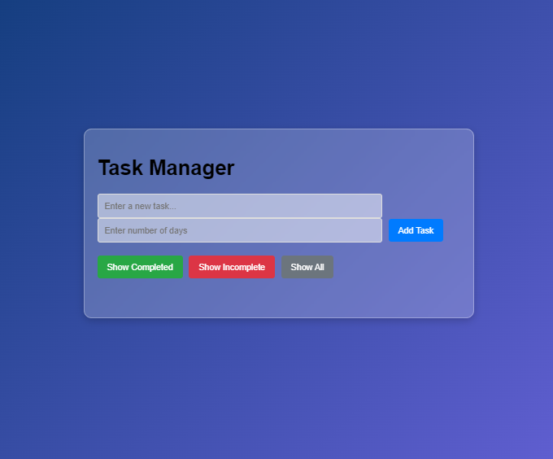
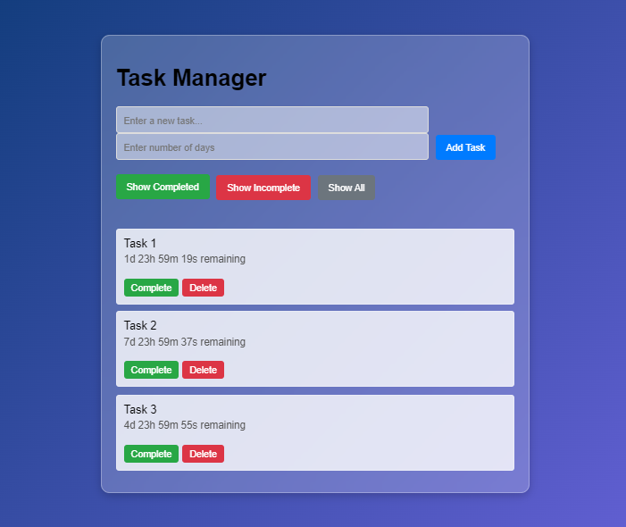
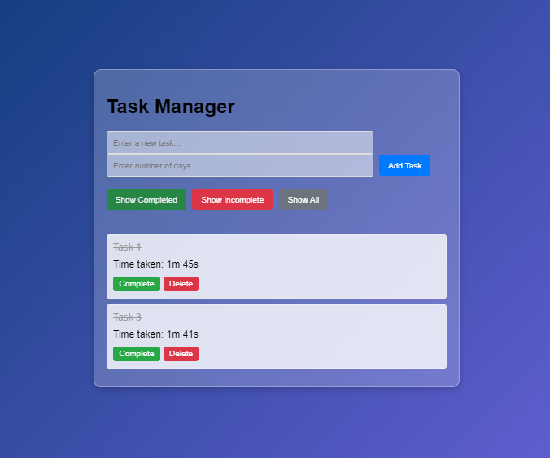

# Task Manager

## Overview

The **Task Manager** is a web application designed to help users efficiently manage their tasks and track their deadlines. It provides a user-friendly interface for adding, updating, and deleting tasks, with filtering options to view tasks based on their completion status.

Created by [Shiva Aryal](mailto:shiva.aryal62@gmail.com), this application uses modern web technologies and features a sleek design to enhance productivity and task management.

### Screenshots


*Main view of the Task Manager application*


*Task details and controls*


*Filtering and task completion options*

## Features

- **Add New Tasks**: Enter a task description and specify the number of days until the task is due.
- **Update Task Completion**: Mark tasks as complete or incomplete.
- **Filter Tasks**: View tasks based on their status—completed, incomplete, or all tasks.
- **Responsive Design**: The application is optimized for various devices with a glassmorphism effect.

## Installation

To set up and run the Task Manager application locally:

1. **Clone the Repository**:
   ```bash
   git clone https://github.com/aryalshiva/task-manager.git
